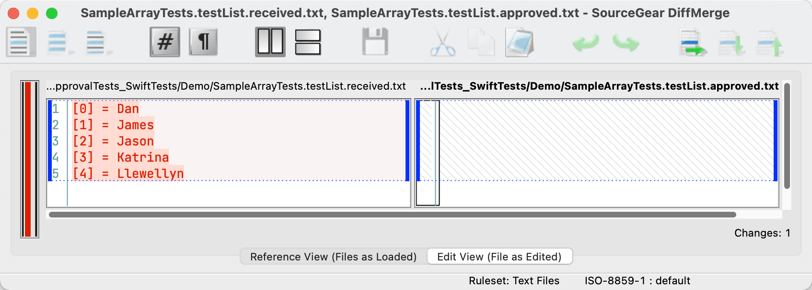
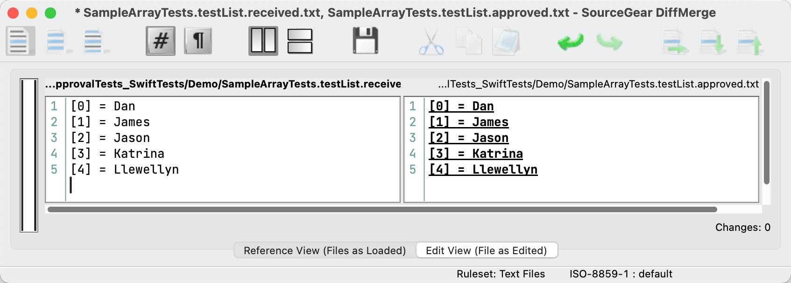

#  ApprovalTests

[](https://github.com/approvals/ApprovalTests.Swift/actions/workflows/build.yml)
[](https://swiftpackageindex.com/approvals/ApprovalTests.Swift)
[](https://swiftpackageindex.com/approvals/ApprovalTests.Swift)
[](https://github.com/Carthage/Carthage)

Approval Tests are an alternative to assertions. You will find them useful for testing objects with complex values (such as long strings), lots of properties, or collections of objects.

ApprovalTests.Swift is compatible with the XCTest testing framework.

<!-- toc -->
## Contents

  * [My First Approval Test](#my-first-approval-test)
  * [Getting Started](#getting-started)
  * [Video Tutorials](#video-tutorials)
  * [Documentation](#documentation)
  * [Podcasts](#podcasts)
  * [How to Get It](#how-to-get-it)
    * [Swift Package Manager](#swift-package-manager)
    * [Carthage](#carthage)
  * [Approved File Artifacts](#approved-file-artifacts)
  * [Questions?](#questions)<!-- endToc -->


## My First Approval Test

We'll start by writing a simple unit test to verify a list of names. But instead of using XCTest's `XCTAssertEqual` function, we'll use `Approvals.verifyAll`:

<!-- snippet: sample_test -->
<a id='snippet-sample_test'></a>
```swift
class SampleArrayTests: XCTestCase {

    func testList() throws {
        var names = ["Llewellyn", "James", "Dan", "Jason", "Katrina"]
        names.sort()
        try Approvals.verifyAll(names)
    }
```
<sup><a href='/ApprovalTests_SwiftTests/Demo/SampleArrayTests.swift#L8-L16' title='Snippet source file'>snippet source</a> | <a href='#snippet-sample_test' title='Start of snippet'>anchor</a></sup>
<!-- endSnippet -->

The `verifyAll()` function performs a test assertion for a list of items. Unlike a normal assertion, it doesn’t specify an expected list. Instead, this will produce a “received” file matching the name of your test suite and test case. In this example, it will write a file `SampleArrayTests.testList.received.txt`:

<!-- snippet: SampleArrayTests.testList.approved.txt -->
<a id='snippet-SampleArrayTests.testList.approved.txt'></a>
```txt
[0] = Dan
[1] = James
[2] = Jason
[3] = Katrina
[4] = Llewellyn
```
<sup><a href='/ApprovalTests_SwiftTests/Demo/SampleArrayTests.testList.approved.txt#L1-L5' title='Snippet source file'>snippet source</a> | <a href='#snippet-SampleArrayTests.testList.approved.txt' title='Start of snippet'>anchor</a></sup>
<!-- endSnippet -->

It also opens two files in a diff editor—the “received” file, and the “approved” file.



To approve the results, tell the diff editor to apply changes from the left side to the right side:



Most of the time, you will use one of the [supported diff tools](docs/reference/reporters.md) to examine and approve the result. If you don’t have any of these diff tools, you can rename the received file to `SampleArrayTests.testList.approved.txt` and the test will now pass.


## Predefined Verifiers

ApprovalTests.Swift comes with useful verifiers:

- `Approvals.verify` — verify object or dictionary
- `Approvals.verifyAll` — verify array of items
- `Approvals.verifyAsJSON` — verify Encodable object converted to JSON
- `Approvals.verifyQuery` — verify query, also showing query results on failure
- `Approvals.verifySequence` — verify sequence of changing values


## Getting Started

Clone the [macOS starter project](https://github.com/approvals/ApprovalTests.Swift.StarterProject.MacOs)


## Video Tutorials

You can watch a bunch of short videos on getting started and [using ApprovalTests in .Net](http://www.youtube.com/playlist?list=PL0C32F89E8BBB5368) at YouTube.


## Documentation

[Find the documentation here](./docs/README.md)


## Podcasts

Prefer learning by listening? Then you might enjoy the following podcasts:

- [This Agile Life](http://www.thisagilelife.com/46/)
- [Hanselminutes](http://www.hanselminutes.com/360/approval-tests-with-llewellyn-falco)
- [Herding Code](http://www.developerfusion.com/media/122649/herding-code-117-llewellyn-falcon-on-approval-tests/)
- [The Watir Podcast](http://watirpodcast.com/podcast-53/)


## How to Get It

### Swift Package Manager

See an example [package manifest](https://github.com/approvals/ApprovalTests.Swift.StarterProject.MacOs/blob/main/Package.swift#L17-L22) here

Get the following dependency:

<!-- snippet: package_include_approvals -->
<a id='snippet-package_include_approvals'></a>
```swift
dependencies: [
    .package(
        name: "ApprovalTests.Swift",
        url: "https://github.com/approvals/ApprovalTests.Swift",
        .branch("master")
        ),
],
```
<sup><a href='#snippet-package_include_approvals' title='Start of snippet'>anchor</a></sup>
<!-- endSnippet -->

Then add it to your test target:

<!-- snippet: package_add_test_target -->
<a id='snippet-package_add_test_target'></a>
```swift
.testTarget(
        name: "ApprovalTests.Swift.StarterProject.MacOSTests",
        dependencies: [
            "ApprovalTests.Swift.StarterProject.MacOS",
            "ApprovalTests.Swift"
        ],
```
<sup><a href='#snippet-package_add_test_target' title='Start of snippet'>anchor</a></sup>
<!-- endSnippet -->

### Carthage

Add the following to your Cartfile:

    github "approvals/ApprovalTests.Swift" "HEAD"

Then drag the the built framework from the appropriate Carthage/Build directory into your project,
but with “Copy items into destination group’s folder” disabled.


## Approved File Artifacts

The `*.approved.*` files must be checked into source your source control. ApprovalTests now ignores line endings by default (so you can remove `*.approved.* binary` from your .gitattributes file if you added previously).

If you would like to verify line endings, simply add `[assembly: IgnoreLineEndingsAttribute(false)]` to your AssemblyInfo.cs

Do not add `*.received.*` files to your source control (they are transitory, and some SCMs like TFS will lock them or mark them read-only, which will break every dependent test).


## Questions?

Ask on Twitter: [@LlewellynFalco](https://twitter.com/llewellynfalco) or #ApprovalTests
